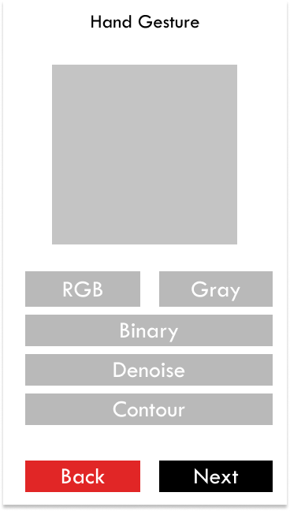

# HandGesture
1. นายฆนัท ยอดสกุลทิพย์ 6234408023
2. นายจิรกฤต จิระพงษ์วนิช 6234409723

## Video Clip
Soon!

ผลงานนี้เป็นส่วนหนึ่งของรายวิชา 2301260 เทคนิคการทำโปรแกรม
ภาคการศึกษาปลาย ปีการศึกษา 2562

### สิ่งที่ทำเพิ่มจากโปรเจคที่มีอยู่เดิม
* ปรับปรุงการแสดงผลให้มีความสวยงามมากยิ่งขึ้น

### อธิบายสิ่งที่ทำ
Soon!

### สิ่งที่ยากสำหรับโปรเจคนี้
* การทำความเข้าใจกับการเข้าถึงกล้อง และที่เก็บข้อมูล และคำสั่งๆ ต่างๆที่ต้องเขียนเพื่อเชื่อมต่อกับกล้องและที่เก็บข้อมูล
* การทำความเข้าใจการทำงานของโปรแกรม

## Landing Page

## Main Page

## Image Preprocessing

## Image Recognition

## About Page

